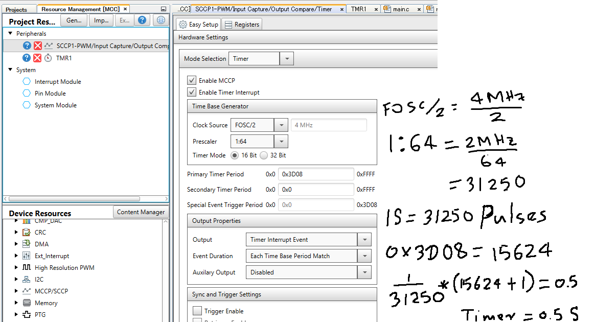
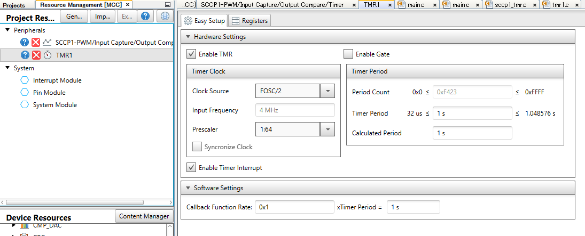
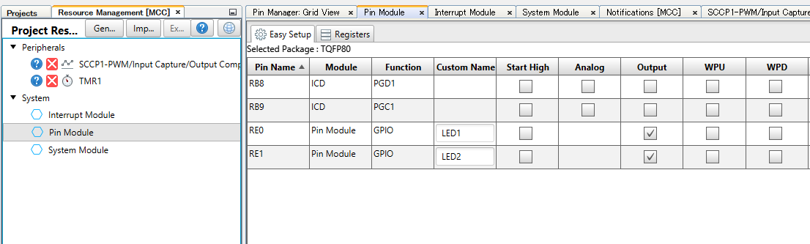

# Overview of Repository
Provide insight and a guide on how to generate mutipel timers using dsPic33CH512MP508  MCCP/SCCP Timer &amp; TMR1 Timer
using [MPLAB X IDE](https://www.microchip.com/en-us/development-tools-tools-and-software/mplab-x-ide) and the [MPLAB Code Configurator](https://www.microchip.com/en-us/development-tools-tools-and-software/embedded-software-center/mplab-code-configurator)

https://user-images.githubusercontent.com/32560614/232948511-3b735e9f-0c20-435a-b09f-6bd7817502b3.mov

# Items used
- (1) [dspic33CH512MP508 Curiosity development board](https://www.microchip.com/en-us/development-tool/DM330028-2) 

# Timer settings
 two different timers 

 MCCP Timer : 0.5S
 TMR1 Timer : 1S

 # LED Toggel settings 
 set the RE0 & RE1 as GPIO|output 

Here's also a screenshot that you can also follow along with the mentioned settings

